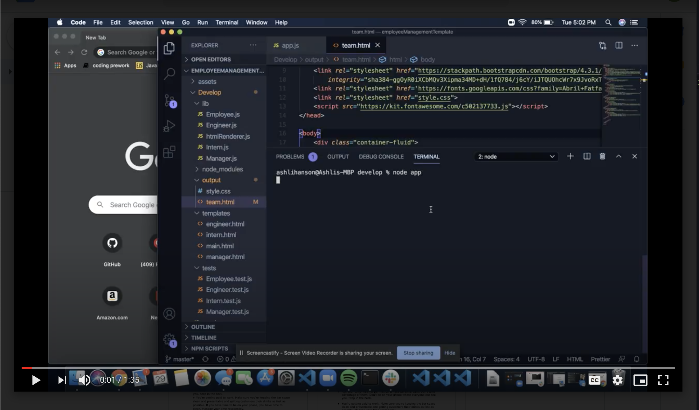

# Employee Management System
 This application allows you to enter team members and their contact information to be generated in this template for max organization and easy retrieval of imperative info during a team project.  

 
 
 ## Installation Instructions 
 These instuctions will walk you through how to use this application locally.
 First you will need to clone the repository to your local machine
 
 ```
 git clone https://github.com/ashlinhanson/employeeManagementTemplate.git
 ```
 After the cloning is complete, install the depencies needed to run the application locally.
 ```
 npm install
 ```
 Once the node modules have been installed, navigate to your 'develop' folder
 ```
 cd develop
 ```
 and then in the command line
 ```
 node app.js
 ```
 and follow the prompts in the terminal.
 Once you have entered the desired information, select
 ```
 Team Complete!
 ```
 and it will produce the html document to be opened in your preferred browser.
 
 View the project live thanks to ScreenCastify: 
[](https://drive.google.com/file/d/1VncifwI_aw-nLA413yY6QmdlNNFESAFb/preview "Watch a Live Example")
   
  
 ## Testing Instructions 
 When the document is completed, you can run a test to ensure the code is working properly and gets all the correct information put in the correct roles. In the Integrated Terminal, type "npm test" to see the results(it will pass them all).
  
## Technologies Used
* HTML5
* CSS3
* Bootstrap4
* JavaScript
* Node.js
* Jest


 ## License  [](https://opensource.org/licenses/MIT) 
 Copyright (c) 2020 Ashli Hanson Licensed under the MIT license.
